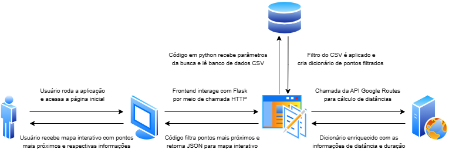

# Configuração do Projeto

## Diagrama de Fluxo da Aplicação



## Ambiente de Desenvolvimento

### Estrutura do Projeto

```
projeto-apc/
│
├── app.py                          # Aplicação Flask
│   └── GET /api/coleta-pontos       # Listar, filtrar, ou paginar
│
├── coleta_service.py               # Camada de Serviço (Lógica de Negócio)
│   └── ler_pontos_por_tipo_lixo()  # Função principal de filtro
│
├── test_coleta_service.py          # Testes Unitários
│   └── TestColetaService           # Suite de testes (10+ casos)
│
├── test_manual.py                  # Script de teste interativo
│
├── pontos-de-coleta.csv            # Dados (246 pontos de coleta)
│
├── requirements.txt                # Dependências Python
│
└── README.md                       # Documentação da API
```

## Fluxo de Requisição

```
Cliente HTTP
    ↓
[app.py - Flask Route]
    ↓
[Validação de Parâmetros]
    ↓
[coleta_service.ler_pontos_por_tipo_lixo()]
    ↓
[Leitura CSV]
    ↓
[Filtro de Dados]
    ↓
[Se lat/lon fornecidos: Chamar enriquecer_pontos_com_distancias()]
    ↓
[Google Routes API v2 - computeRouteMatrix]
    ↓
[Adicionar distance_km e duration_min]
    ↓
[Se n fornecido: Filtrar N pontos mais próximos]
    ↓
[Formatação JSON]
    ↓
Resposta HTTP (JSON)
```

## Decisões de Design

### 1. Separação em Camadas
- **app.py**: Apenas lógica de HTTP e roteamento
- **coleta_service.py**: Lógica de negócio pura (testável sem HTTP)

### 2. REST API Design
- Recurso: `coleta-pontos` (substantivo, plural)
- Operações: GET (idempotente, segura)
- Query parameters para filtros: `?tipos=...`
- Path parameters para recursos específicos: `/<id>`

### 3. Formato de Resposta
- JSON estruturado com metadados
- Status codes HTTP apropriados
- Mensagens de erro descritivas

### 4. Testes
- Testes unitários sem dependência HTTP (usando arquivo CSV temporário)
- Cobertura de casos normais, casos limites e erros
- Não requerem Flask ou servidor rodando

## Como Executar

### Instalar Dependências
```bash
pip install -r requirements.txt
```

### Executar Testes Unitários
```bash
python -m unittest test_coleta_service.py -v
```

### Teste Manual (Interativo)
```bash
python test_manual.py
```

### Executar Servidor Flask
```bash
python app.py
```

### Testar Endpoints (curl)
```bash
# Listar todos
curl "http://localhost:5000/api/coleta-pontos"

# Filtrar por tipos
curl "http://localhost:5000/api/coleta-pontos?tipos=pilhas"

# Navegar para página 2
curl "http://localhost:5000/api/coleta-pontos?page=2"

# Filtrar e paginar
curl "http://localhost:5000/api/coleta-pontos?tipos=pilhas&page=2"
```

## Tipos de Lixo Disponíveis

- `eletroeletronicos`
- `eletrodomesticos`
- `pilhas`
- `lampadas`

(Combinações são possíveis usando o separador `\,` no CSV)

## Boas Práticas Implementadas

✓ **REST API Design**
- URIs baseadas em recursos
- Métodos HTTP corretos
- Status codes apropriados
- Versioning preparado (v1 em `/api/`)

✓ **Clean Code**
- Separação de responsabilidades
- Funções com responsabilidade única
- Nomes descritivos
- Documentação de docstrings

✓ **Testabilidade**
- Lógica de negócio independente de HTTP
- Testes sem efeitos colaterais
- Arquivo CSV de teste temporário

✓ **Error Handling**
- Try-catch em pontos críticos
- Mensagens de erro descritivas
- Status codes HTTP apropriados

✓ **Performance**
- Operações O(n) eficientes para o volume de dados
- Sem queries desnecessárias
- Possibilidade de paginação

## Integração com Google Routes API v2

### Implementado

- ✓ Função `get_distances_from_google()` para chamar API (computeRouteMatrix)
- ✓ Função `enriquecer_pontos_com_distancias()` para orquestração
- ✓ Configuração IPv4-only para resolver problemas de timeout no Windows
- ✓ Tratamento de erros com fallback
- ✓ Campos `distance_km` e `duration_min` nas respostas
- ✓ Ordenação por tempo de direção para encontrar pontos próximos
- ✓ Headers necessários (X-Goog-Api-Key, X-Goog-FieldMask)

### Requisitos

- Chave de API do Google (Routes API habilitada)
- Pacote `requests` instalado
- Coordenadas de latitude/longitude válidas do usuário
- Variável de ambiente GOOGLE_API_KEY configurada

## Próximas Melhorias Possíveis

- [ ] Autenticação e autorização
- [ ] Cache com Redis
- [ ] Banco de dados (PostgreSQL)
- [ ] Documentação com Swagger/OpenAPI
- [ ] Testes de integração com requests
- [ ] Docker container
- [ ] CI/CD pipeline
- [ ] Rate limiting
- [ ] Logging estruturado
- [ ] Cache de resultados de Google API
- [ ] Suporte a múltiplos modos de transporte (caminhada, bicicleta, etc)
